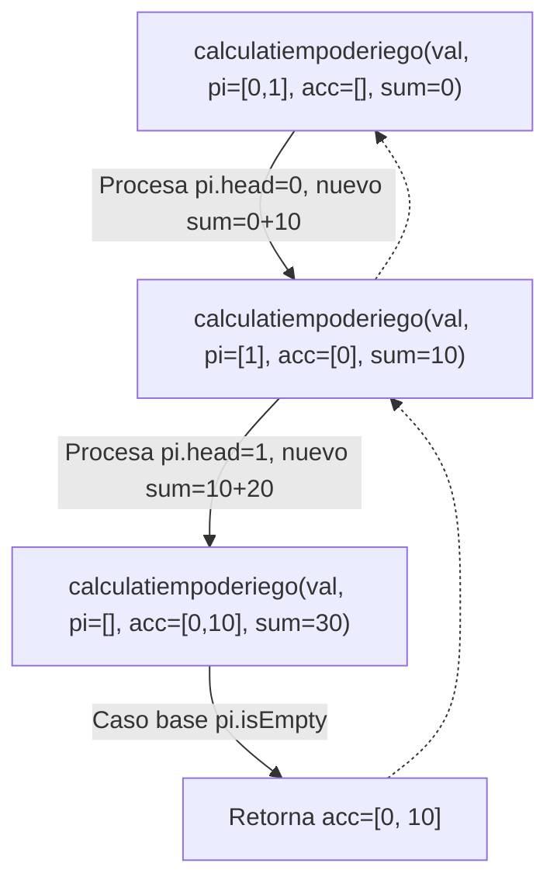
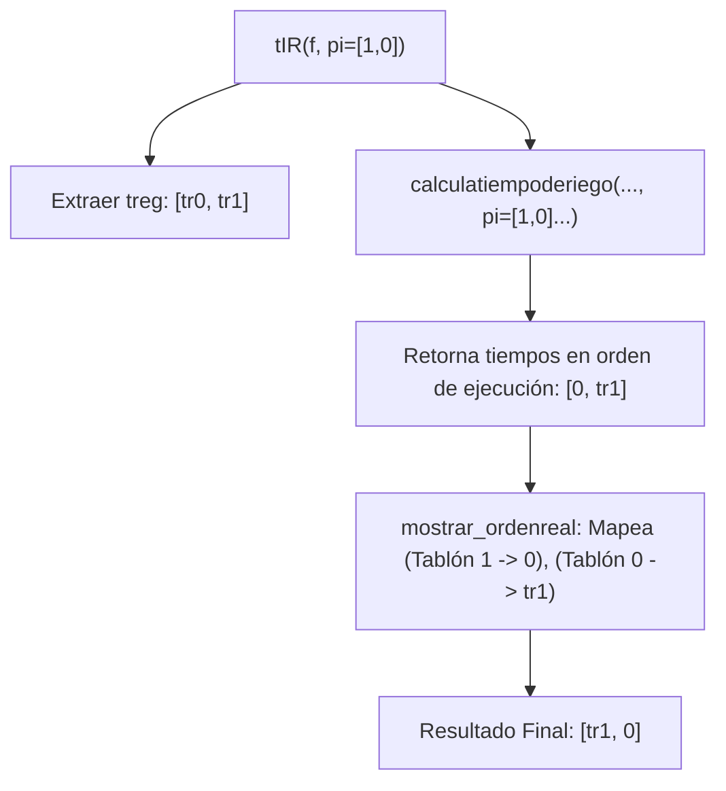
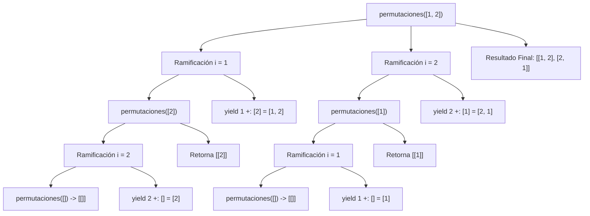
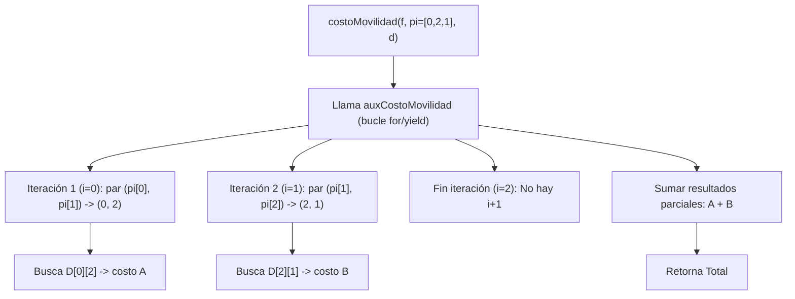
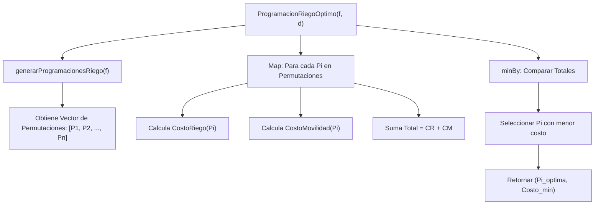

# Proyecto Final: Programación Funcional y Concurrente

## Informe de Proceso

---

# 1. Introducción

Este informe presenta el **proceso interno de ejecución** de las funciones implementadas para la solución del **Problema del Riego Óptimo**. El objetivo es encontrar una secuencia de riego que minimice los costos asociados al sufrimiento del cultivo y al desplazamiento de la maquinaria.

El análisis aborda:
* Generación de espacios de búsqueda (permutaciones) mediante recursión.
* Cálculo acumulativo de tiempos de inicio de riego ($t_{ini}$).
* Evaluación de costos mediante funciones de asignación y reducción.
* Estrategia de selección del óptimo global.

---

# 2. Fundamento Teórico

## 2.1. Representación del Problema

El problema se modela utilizando tipos de datos inmutables y algebraicos:
* **Finca ($F$):** Vector de tablones $\langle ts, tr, p \rangle$.
* **Programación ($\Pi$):** Permutación de índices $\{0, \dots, n-1\}$.

## 2.2. Cálculo de Tiempos (Recursión Acumulativa)

El tiempo de inicio de riego es dependiente del tablón anterior. Dado un orden $\Pi$, el tiempo se define recursivamente:

$$t_{\pi_0}^{\Pi} = 0$$
$$t_{\pi_j}^{\Pi} = t_{\pi_{j-1}}^{\Pi} + tr_{\pi_{j-1}}^{F}$$

## 2.3. Funciones de Costo

Se definen dos costos que deben minimizarse conjuntamente:

### Costo de Riego ($CR$)
Penalización basada en si el tiempo de supervivencia es excedido.

$$CR_{F}^{\Pi}[i] = \begin{cases} ts_i - (t_i + tr_i) & \text{si } ts_i \ge t_i + tr_i \\ p_i \cdot |(t_i + tr_i) - ts_i| & \text{de lo contrario} \end{cases}$$

### Costo de Movilidad ($CM$)
Suma de los pesos de las aristas recorridas en el grafo de la finca (matriz de adyacencia).

$$CM_{F}^{\Pi} = \sum_{j=0}^{n-2} D[\pi_j, \pi_{j+1}]$$

---

# 3. Implementación

## 3.1. Clase `Riego`

```scala
package taller
import taller.Tipos.{ProgRiego, _}

class Riego {

  def tsup ( f : Finca , i : Int ) : Int = {
    f ( i ) . _1
  }
  def treg ( f : Finca , i : Int ) : Int = {
    f ( i ) . _2
  }
  def prio( f : Finca , i : Int ) : Int = {
    f ( i ) . _3
  }

  def calculatiempoderiego(valores: Vector[Int], pi: ProgRiego, vector_final: Vector[Int], suma: Int): Vector[Int] = {
    if (pi.isEmpty) vector_final
    else calculatiempoderiego(valores, pi.tail, vector_final :+ suma, suma + valores(pi.head))

  }

  def mostrar_ordenreal(vector_orden: Vector[Int],orden_riego: ProgRiego, vector_desorganizado: Vector[Int]): Vector[Int] = {
    val orden_real = (for {
      i <- vector_orden
      j <- orden_riego
      if i == j
    } yield vector_desorganizado(orden_riego.indexOf(j))).toVector
    orden_real
  }

  def tIR(f: Finca, pi: ProgRiego): TiempoInicioRiego = {
    // Dada una finca f y una programación de riego pi,
    // y f.length == n, tIR(f, pi) devuelve t: TiempoInicioRiego
    // tal que t(i) es el tiempo en que inicia el riego del
    // tablon i de la finca f según pi
    val valores_tr = (for {
      i <- f.indices
    } yield treg(f , i) ).toVector
    val tiemposInicio = calculatiempoderiego(valores_tr, pi, Vector.empty, 0)
    val valores_organizados_tablones = mostrar_ordenreal((0 until f.length).toVector, pi, tiemposInicio)
    valores_organizados_tablones
  }

  def costoRiegoTablon(i: Int, f: Finca, pi: ProgRiego): Int = {
    // Calcula el costo de riego del tablón ival de la finca f
    // según la programación de riego pi
    val costoRiegoParcial = tsup(f,i) - tIR(f, pi)(i) - treg(f,i)
    if (costoRiegoParcial >= 0) costoRiegoParcial else prio(f,i) * Math.abs(costoRiegoParcial)
  }

  def costoRiegoFinca(f: Finca, pi: ProgRiego): Int = {
    val costoRiegoTotal = pi.map(i => costoRiegoTablon(i, f, pi))
    costoRiegoTotal.sum
  }
  //
  def costoMovilidad(f: Finca, pi: ProgRiego, d: Distancia): Int = {
    // Calcula el costo de movilidad para regar todos los tablones
    // según la programación pi y la matriz de distancias d
    def auxCostoMovilidad(f: Finca, pi: ProgRiego, d: Distancia):Int ={
      val resultado_parcial = for {
        i <- pi.indices
        if (i + 1) - f.length < 0
      }yield d(pi(i))(pi(i+1))
      resultado_parcial.sum

    }
    auxCostoMovilidad(f, pi, d )

  }

  def permutaciones(l: Vector[Int]): Vector[Vector[Int]] = l match {
    case Vector() => Vector(Vector.empty)
    case _ =>
      for {
        i <- l
        resto = l.filter(_ != i)
        p <- permutaciones(resto)
      } yield i +: p
  }

  def generarProgramacionesRiego(f: Finca): Vector[ProgRiego] = {
    // Dada una finca de n tablones, devuelve todas las
    // posibles programaciones de riego de la finca
    val n = f.length
    val indices = (0 until n).toVector
    val perms = permutaciones(indices)
    perms
  }

  def ProgramacionRiegoOptimo(f: Finca, d: Distancia): (ProgRiego, Int) = {
    //    // Dada una finca devuelve la programación
    //    // de riego óptima
    val programaciones = generarProgramacionesRiego(f)

    if (programaciones.isEmpty) (Vector.empty[Int], 0)
    else {
      programaciones
        .map { pi =>
          val cr = costoRiegoFinca(f, pi)
          val cm = costoMovilidad(f, pi, d)
          val total = cr + cm
          (pi, total)
        }
        .minBy(_._2)    // escoger el que tenga costo mínimo
    }
  }

  //  def costoRiegoFincaPar(f: Finca, pi: ProgRiego): Int = {
  //    // Devuelve el costo total de regar una finca f dada una
  //    // programación de riego pi, calculando en paralelo
  //  }
  //
  //  def costoMovilidadPar(f: Finca, pi: ProgRiego, d: Distancia): Int = {
  //    // Calcula el costo de movilidad de manera paralela
  //  }

}

```
Estructura:
### Funciones Auxiliares de Acceso (tsup, treg, prio)

- `tsup`:
    - Accede al **Tiempo de Supervivencia** (`_1`) del tablón $i$.
    - Lectura directa de la primera componente de la tupla `f(i)`.

- `treg`:
    - Accede al **Tiempo de Riego** (`_2`) del tablón $i$.
    - Lectura directa de la segunda componente de la tupla `f(i)`.

- `prio`:
    - Accede a la **Prioridad** (`_3`) del tablón $i$.
    - Lectura directa de la tercera componente de la tupla `f(i)`.

- `calculartiempoderiego`:
    - Es una función recursiva de cola.
    - Acumula el tiempo actual en `suma` y construye `vector_final` paso a paso.

- `mostrar_ordenreal`:
    - Reordena el vector de tiempos de inicio calculado (`vector_desorganizado`) para que cada tiempo esté asociado a su **índice de tablón original** (0, 1, 2, ...).
    - Utiliza una **for-comprehension** anidada con un filtro (`if i == j`) para realizar el mapeo.
    - Itera sobre los índices originales y la programación, buscando la posición del tablón en la programación para acceder al tiempo correspondiente en `vector_desorganizado`.

- `tIR`:
    - Guía el cálculo. Extrae los tiempos de regado, llama a la recursión y luego reordena los resultados (utilizando `mostrar_ordenreal`) para que coincidan con los índices originales de la finca.

- `costoRiegoTablon`:
    - Calcula el **costo de sufrimiento** de un tablón individual $i$.
    - Implementa una **lógica condicional** para el cálculo del costo:
      - Si el tiempo de supervivencia (`tsup`) es suficiente, el costo es la diferencia restante (recompensa o costo mínimo).
      - Si el tiempo de supervivencia se excede, aplica la **penalización** multiplicando el tiempo de déficit absoluto por la prioridad (`prio`).

- `costoRiegoFinca`:
    - Calcula el **Costo Total de Riego** para toda la finca $F$ dada la programación $\Pi$.
    - Función de **Orden Superior** (Map y Reduce).
    - Utiliza `.map` sobre la programación $\Pi$ para aplicar `costoRiegoTablon` a cada tablón, y luego utiliza `.sum` para reducir la colección al costo total.

- `costoMovilidad`:
    - Calcula el **Costo Total de Movilidad** incurrido al seguir el orden de riego $\Pi$ usando la matriz de distancias $D$.
    - Utiliza una función auxiliar anidada (`auxCostoMovilidad`) con una **for-comprehension**.
    - Itera sobre los índices de $\Pi$ para obtener pares consecutivos $(\Pi[i], \Pi[i+1])$ y accede a la distancia $D[\Pi[i], \Pi[i+1]]$. Finalmente, suma los resultados.

- `permutaciones`:
    - Genera el espacio de búsqueda completo.
    - Utiliza la recursión de árbol: por cada elemento, genera las permutaciones del resto.

- `generarProgramacionesRiego`:
    - Genera el **espacio completo de soluciones** (todas las $\Pi$ posibles) para una finca $F$ de $n$ tablones.
    - Función de **envoltorio**.
    - Determina el tamaño $n$ de la finca, crea el vector de índices iniciales (`0 until n`) y llama a `permutaciones` para obtener el conjunto completo de programaciones.

- `ProgramacionRiegoOptimo`:
    - Función de alto orden. Genera el espacio de estados, "mapea" cada estado a un costo total y "reduce" buscando el mínimo.

## 3.2. Clase `Generador_aleatorio`

```scala
package taller
import taller.Tipos._
import scala.util.Random

class Generador_aleatorio {

  val random = new Random()

  def fincaAlAzar(long: Int): Finca = {
    // Crea una finca de long tablones,
    // con valores aleatorios entre 1 y long * 2 para el tiempo
    // de supervivencia, entre 1 y long para el tiempo
    // de regado y entre 1 y 4 para la prioridad
    val v = Vector.fill(long)(
      (random.nextInt(long * 2) + 1,
        random.nextInt(long) + 1,
        random.nextInt(4) + 1)
    )
    v
  }

  def distanciaAlAzar(long: Int): Distancia = {
    // Crea una matriz de distancias para una finca
    // de long tablones, con valores aleatorios entre
    // 1 y long * 3
    val v = Vector.fill(long, long)(random.nextInt(long * 3) + 1)
    Vector.tabulate(long, long)((i, j) =>
      if (i < j) v(i)(j)
      else if (i == j) 0
      else v(j)(i)
    )
  }
}
```

Estructura:
- `random:`
    - Instancia de la clase `Random` de Scala para generar números aleatorios.
- `fincaAlAzar:`
    - Utiliza `Vector.fill(long)` para crear un vector de tamaño `long`.
    - Cada elemento es una tupla `(ts, tr, p)` que representa un tablón.
    - Los valores de la tupla se generan usando `random.nextInt(Límite) + 1` para asegurar que el valor mínimo sea 1.
    - Generar de forma pura un conjunto de datos inmutable (`Finca`) para simular el problema de optimización.
- `distanciaAlAzar:`
    - Crea una matriz cuadrada `v` de `long x long` llenada con valores aleatorios.
    - Usa `Vector.tabulate(long, long)` para construir la matriz final, garantizando las propiedades de una matriz de distancias:
        - **Diagonal:** `(i == j) => 0` (la distancia de un tablón a si mismo es cero).
        - **Simetría:** `(i > j) => v(j)(i)` (la distancia de $j$ a $i$ es igual a la distancia de $i$ a $j$).
        - **Triángulo superior:** `(i < j) => v(i)(j)` (se usan los valores generados aleatoriamente).
    - Crea una matriz inmutable y simétrica para modelar el costo de movilidad.
---
# 4. Informe de Proceso

## 4.1. Pila de llamados - calculatiempoderiego



## 4.2. Flujo de datos - tIR (Tiempo Inicio Riego)



## 4.3. Pila de llamados - permutaciones



## 4.4. Flujo de Proceso - costoMovilidad



## 4.5. Proceso General - ProgramacionRiegoOptimo



---
# 5. Conclusiones
- **Recursión de cola:** La implementación de `calculatiempoderiego` utiliza recursión de cola, lo que optimiza el uso de la pila (stack) al no dejar operaciones pendientes en cada llamada recursiva.
- **Complejidad Factorial:** La función `permutaciones` genera un árbol de llamadas que crece factorialmente ($n!$). Esto indica que para fincas grandes, el tiempo de procesamiento secuencial crecerá exponencialmente.
- **Independencia de tareas:** El cálculo de costos (`costoRiegoFinca` y `costoMovilidad`) para cada permutación es independiente entre sí. Esto sugiere que la etapa de `map` dentro de `ProgramacionRiegoOptimo` es el candidato ideal para la paralelización en la siguiente fase del proyecto.